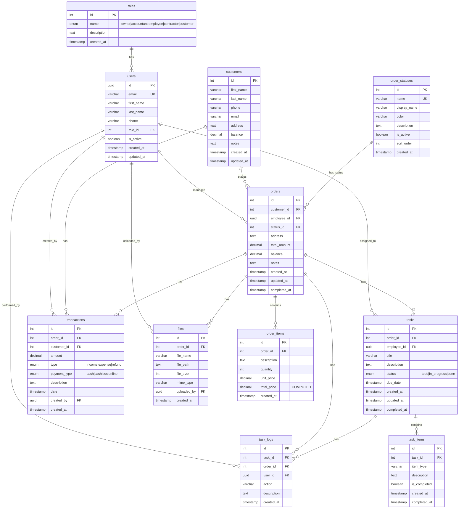

# SmartCRM Database ER Diagram

## Entity Relationship Diagram

## Table Relationships

### **Core Entities**

1. **roles** → **users** (1:N)
   - Each user has one role
   - A role can be assigned to many users

2. **users** (Employees)
   - Manages orders
   - Assigned to tasks
   - Creates transactions
   - Uploads files
   - Performs actions (task_logs)

3. **customers**
   - Places orders
   - Has transaction history
   - Has balance tracking

### **Order Management**

1. **orders**
   - Belongs to one customer
   - Managed by one employee
   - Contains multiple order_items
   - Has multiple tasks
   - Has transaction history
   - Can have attached files

2. **order_items**
   - Line items for each order
   - Tracks quantity, price, and total

### **Task Management**

1. **tasks**
   - Belongs to one order
   - Assigned to one employee
   - Contains checklist items (task_items)
   - Has activity logs

2. **task_items**
   - Checklist items for tasks
   - Predefined types (removal, delivery, installation, etc.)

### **Financial Tracking**

1. **transactions**
   - Linked to orders and customers
   - Tracks income, expenses, refunds
   - Multiple payment types

### **Supporting Tables**

1. **files**
   - Attached to orders
   - Tracks uploader and metadata

2. **task_logs**
   - Activity history for tasks and orders
   - Audit trail

## Data Flow

## Key Features

### Financial Tracking

- Customer balance management
- Order balance tracking (paid vs. total)
- Transaction history with types (income/expense/refund)
- Multiple payment methods

### Task Management Features

- Tasks linked to orders
- Checklist items for each task
- Employee assignment
- Status tracking
- Activity logs

### Audit Trail

- `created_at` and `updated_at` timestamps on all major tables
- `task_logs` for activity history
- User tracking on transactions and files

### Flexibility

- ENUM types for standardized values
- Soft relationships (nullable FKs where appropriate)
- Computed columns (e.g., `total_price` in order_items)
- Views for common queries

## Indexes Strategy

- **Primary Keys**: All tables have indexed PKs
- **Foreign Keys**: All FKs are indexed for join performance
- **Status Fields**: Indexed for filtering
- **Date Fields**: Indexed for time-based queries
- **Email/Phone**: Indexed for search functionality

## Triggers

- **Auto-update timestamps**: `updated_at` automatically updated on record changes
- **Future enhancements**: Could add triggers for:
  - Auto-calculate order totals from order_items
  - Auto-update customer balance from transactions
  - Auto-create task_logs on status changes
